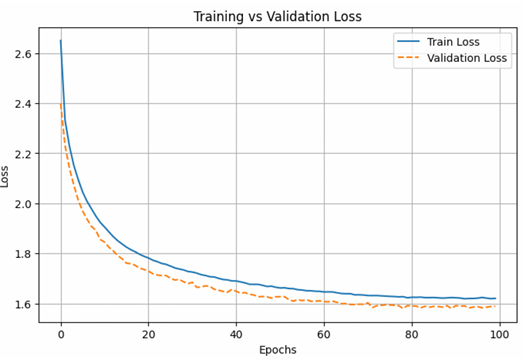

# Hangman

## What is Hangman?

**Hangman** is a classic word-guessing game where the player attempts to uncover a hidden word by suggesting letters one at a time.  
Each incorrect guess results in a part of a stick figure being drawn on a gallows.  
The game concludes when the player either successfully guesses the word or the stick figure is fully drawn, indicating too many incorrect guesses.


```
 _______
 |     |
 |     O
 |    /|\
 |    / \
 |
_|_
```

*Example Hangman figure after several incorrect guesses.*

## Approaches

To solve the Hangman problem, I approached the problem with a few approaches, the 
classical n-gram matching approach, neural networks, LSTM, Bi-LSTM, and transformers. In 
order to test the efficacy of all the approaches I divided my dataset (words_250000.txt) into 2 
parts (90% training, 10% validation). These approaches could not achieve the desired 
performance level, however, while using transformers I realised that the Hangman game 
seems like the perfect use-case for BERT, since BERT was also trained to predict masked 
words in a sentence. 

I tried several approaches with the BERT and Canine-S architecture. Canine-S model is 
similar to BERT but instead of word embeddings it was trained on character level 
embeddings. I did 16-20 experiments with different losses, architectures and training setups: 
* Cross Entropy loss over all masked characters 
* Cross Entropy loss over the mean of the output logits of all masked characters (mean 
pooling) 
* Cross Entropy loss over the maximum of the output logits of all masked characters 
(max pooling) 
* KL Divergence loss 
* Focal Loss - this basically assigns a higher loss to infrequent characters such as ‘q’, 
‘x’ and lower loss to frequent characters like ‘a’ and ‘e’. The frequency was calculated 
using the training set. 
* __Cross Entropy loss combined with n-gram prediction when the word is almost 
predicted (3 characters or less remaining to be predicted)__
* Reinforcement Learning with BERT model as the policy 
* Reinforcement Learning with BERT model as the policy and custom rewards 
depending on the character frequency (higher reward for infrequent characters) 

The highlighted approach gives the best results.


My training setup included finetuning the last 2 encoder layers of the BERT model with a 
learning rate of 3e-5, a cosine learning rate scheduler with a warmup of 10%, AdamW 
optimizer with a weight decay of 0.01. The guessed vector was provided to the BERT model 
in the beginning to ensure that the model learns to negate the effects of those characters 
while predicting the next character. 

When testing this approach I achieved an accuracy of 61% accuracy in winning the 
hangman game with words from my validation set. Upon initial analysis the model did not 
perform well with words involving the character ‘q’ and failed even with simple words like 
‘queue’ and ‘squid’, highlighting the importance of training dataset quality in training BERT. I 
tried different approaches to counter that problem such as focal loss and Custom Reward 
Reinforcement Learning setup, however they did not result in significantly better results.  

# N-Gram approach
For further performance improvement I decided to combine the n-gram approach with the 
BERT approach during evaluation.I created three different dictionaries, one trigram 
dictionary and two bigrams dictionary. During the last stages of evaluation, when there are 
only three or less characters remaining to be predicted, we consider the letter to the left and 
right of each masked word and get the probability of each character from our dictionary. The 
reason to have two bigram dictionaries is to ensure in cases when the masked character is 
the first letter or the last letter of the word, or two consecutive letters are masked, I can still 
utilize this approach by considering the bigram dictionary. I took the weighted sum of these 
probabilities along with the probabilities from the BERT model to get the final probabilities. 
While BERT simultaneously provides a prediction for all the masked characters, we only 
need to predict one character for each step in the game of Hangman. I took a greedy 
approach and considering only the masked characters took the character with the maximum 
probability. 

# Results
After validating my approach and achieving an above-par performance (66%), I retrained the 
model on the entire dataset with the same setup and ran on the API provided to get an 
accuracy of 62% on the practice setup using this specific setup and 60% on the recorded 
games. 



# Reproducibility

1. **Clone the repository in a conda environment**
   ```
   git clone https://github.com/hkhanuja/Hangman.git
   cd your-repo
   conda create -n env_name python=3.10
   conda activate env_name
   pip install -r requirements.txt
   ```
2. **Finetune the BERT model (to get the finetuned model weights)**
   ```
   cd bert_ce
   python bert_ce.py
   ```

3. **Evaluate using N-gram + BERT approach**
   ```
   cd bert_ce
   python bert_ce_evaluation_with_n_gram.py
   ```

# Future work

Given the limited dataset size, focal loss offers significant advantages in addressing class imbalance and hard-to-classify examples. A strategy that integrates fine-tuning BERT with focal loss and fuses its predictions with an n-gram based approach at inference is likely to enhance overall accuracy and robustness.
   
